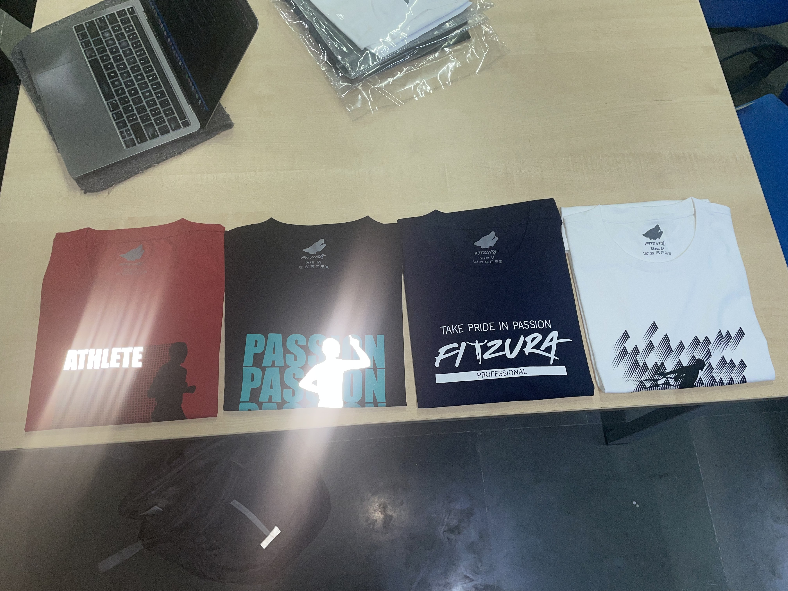
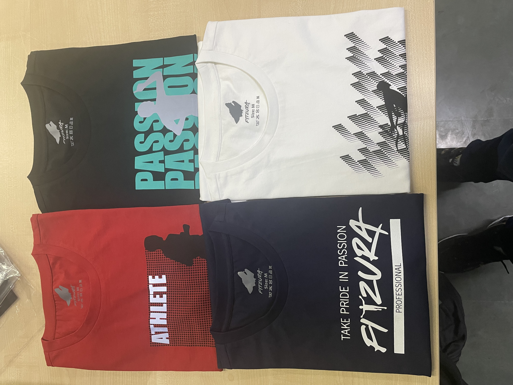
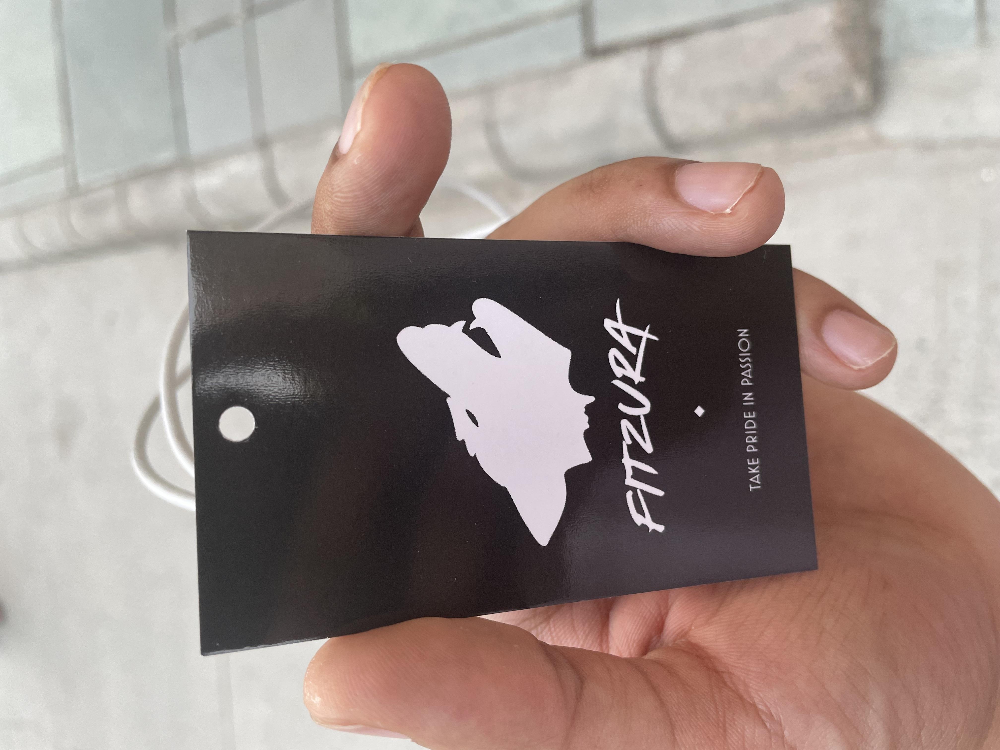
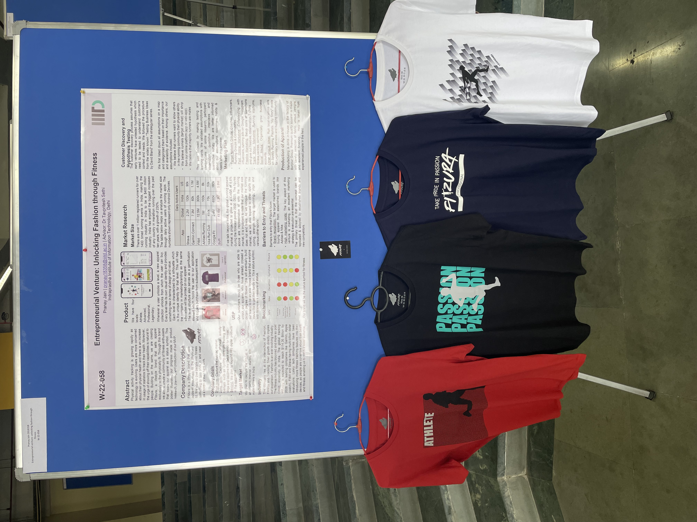
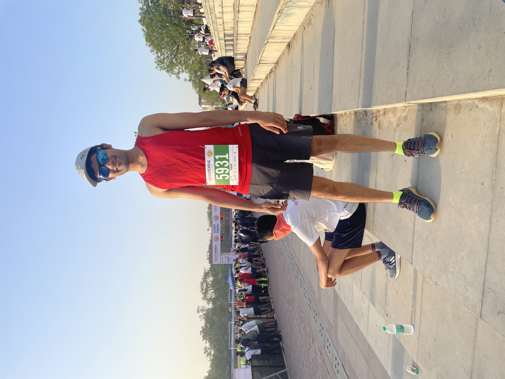

# Fitzura — My First Startup

Fitzura was my first startup, built with two close friends. The concept was simple but bold: track users' fitness activity, assign them points based on their performance, and let them unlock exclusive apparel collections only after hitting certain milestones. Think of it as a battle pass — but for fitness.

People show off their wealth through the brands they wear. We wanted to create a world where they could show off their level of fitness instead.

The long-term vision was to partner with brands like Adidas and Nike to launch exclusive collections, positioning Fitzura as the platform that tracks fitness, assigns scores, and unlocks apparel when certain levels are reached.

*The first Fitzura collection — "Athlete," "Passion," and "Take Pride in Passion" designs.*

*A closer look at the four debut Fitzura designs.*

*The Fitzura brand tag — "Take Pride in Passion."*

*Presenting Fitzura at the IIIT Delhi entrepreneurship showcase — research poster alongside the apparel line.*

*Living the Fitzura ethos — competing in running events and pushing fitness limits.*

*The Fitzura crew at a Delhi Runners Group event — walking the talk.*

We were three computer science students building this in college — passionate about fitness but lacking the fashion industry connections and understanding needed to scale. Eventually, we moved on to pursue other opportunities.

The Fitzura experience is best captured in this reel by one of my cofounders and closest friends:
[Watch the Fitzura Reel on Instagram](https://www.instagram.com/reel/ChITn1BjcNt0GutvtlKaEri8cNm-tOXKWieLEI0/?igsh=MTMzb2g4a2g0YTQ3aw==)
