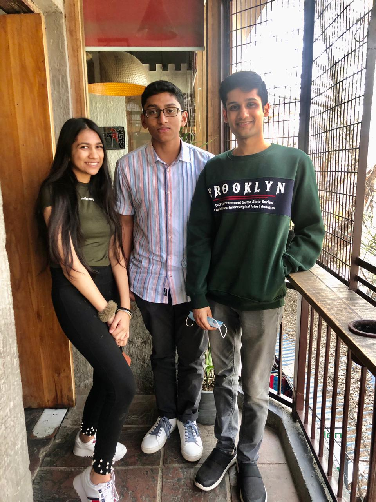
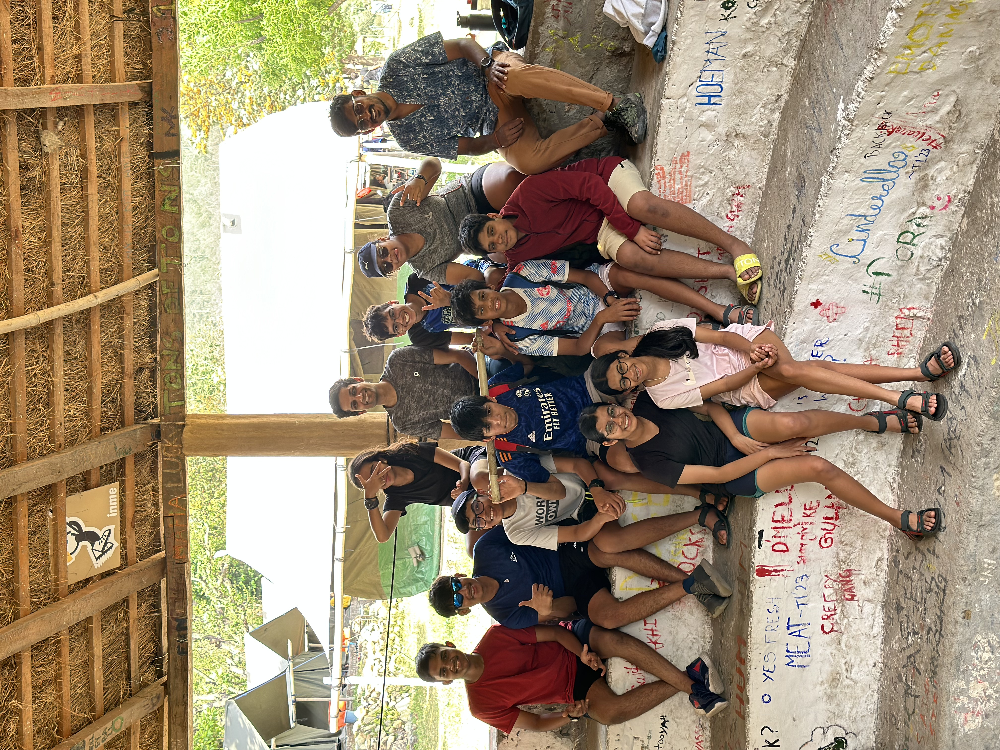
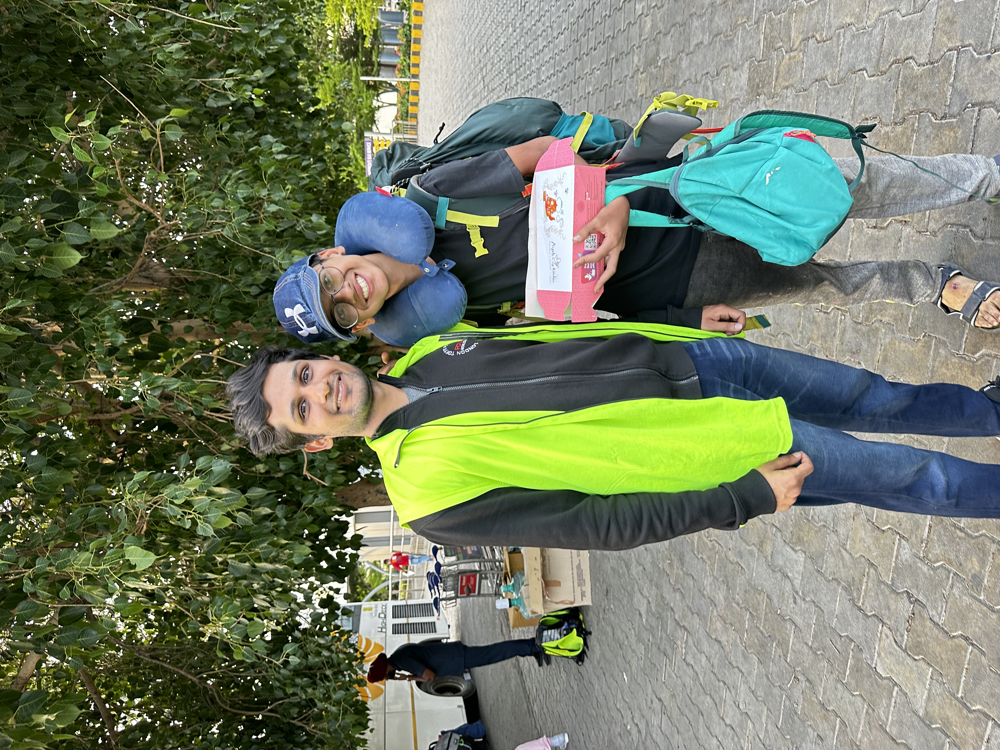

# Mentorship

I love mentoring. Adventurous and ambitious paths are tough and challenging, and it often happens that those who are a few steps behind you are walking the same ones you once did. In those moments, I find deep fulfilment in helping them navigate the journey.

*With my undergraduate mentees — taking them out to my favourite breakfast spot in the city.*

Eight years after attending Inme Camp — a camp that instilled some of the most important values in my life — I went back as a volunteer to inspire those same values in the next generation. And yes, I'm always the kids' favourite.

*Back at Inme Camp after 8 years — volunteering and giving back to the community that shaped me.*

*Adventures with the camp crew — mountain biking through the trails.*

*Out and about with fellow camp volunteers.*
