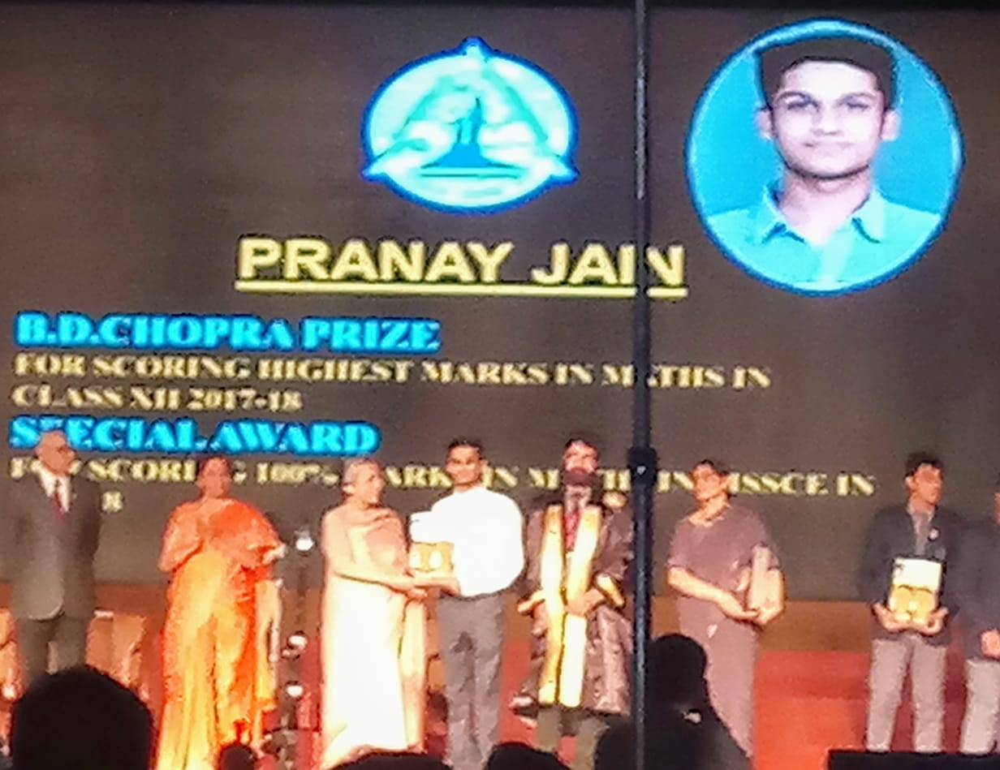

# School

Sports defined my school years. I was deeply passionate about athletics, and I believe some of my strongest qualities and core values were forged on the basketball court. Through the end of 11th grade, sports consumed my world — I competed in and won numerous tournaments across multiple levels.

*Featured in a national newspaper for basketball achievements.*

I also had the honour of being chosen as the flag bearer of my house — a recognition reserved for the student with the most outstanding sports achievements.

*Carrying the house flag — a proud moment representing years of athletic dedication.*

Then came 12th grade, and something shifted. A growing love for science and hard questions pulled me in a new direction. For the first time in my life, I actually studied — and I absolutely loved it. That year of academic focus paid off in ways I never expected.

*Receiving the B.D. Chopra Prize and Academic Excellence Award from the Finance Minister of India, Smt. Nirmala Sitharaman — graduating top of my class.*
