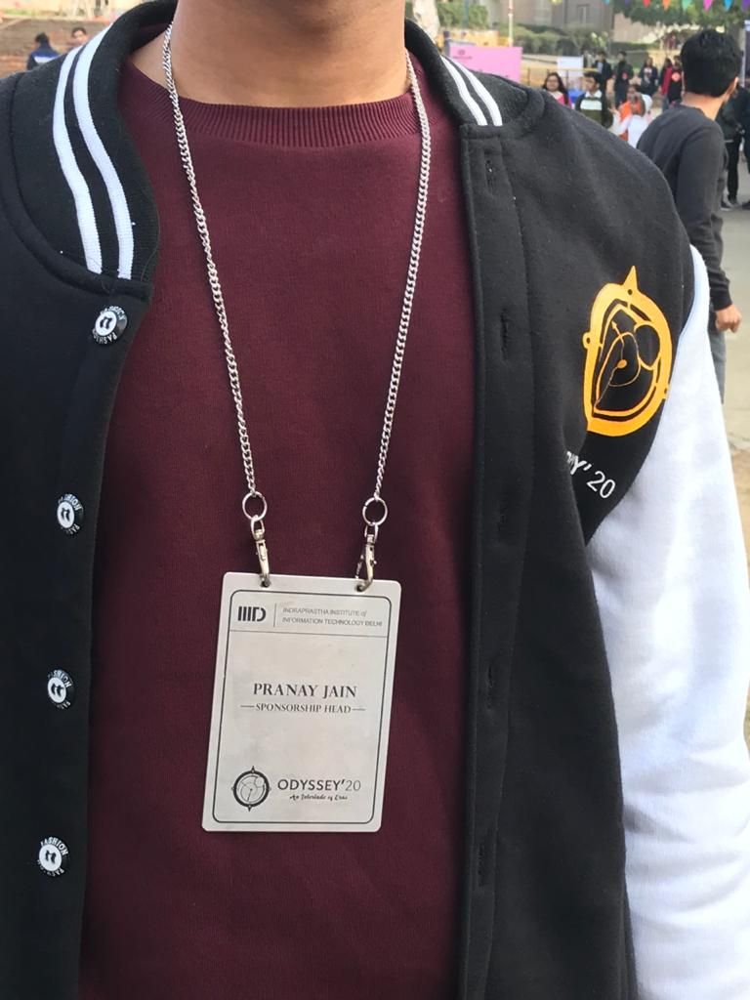
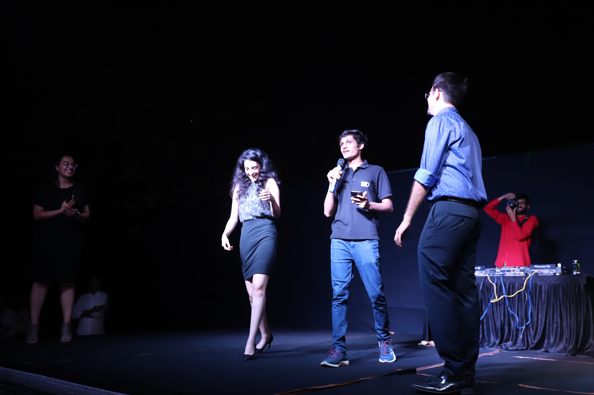
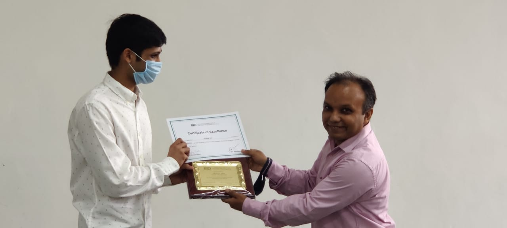
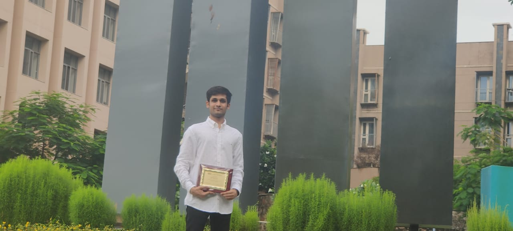
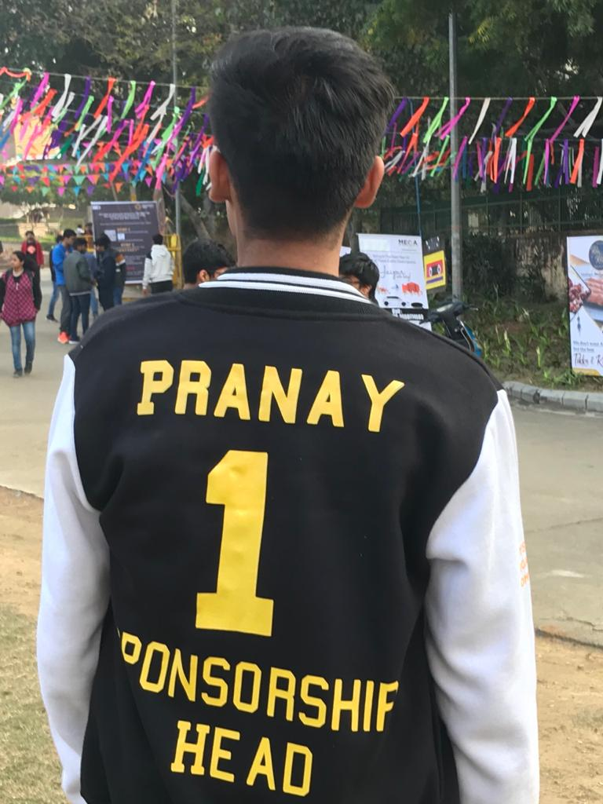
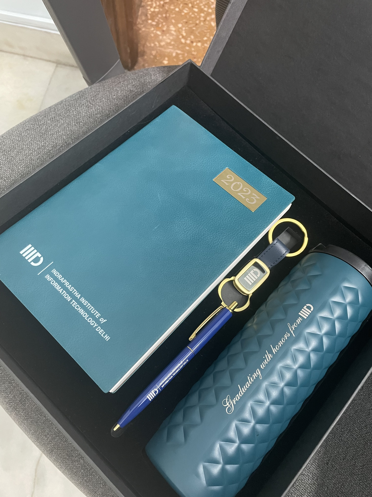
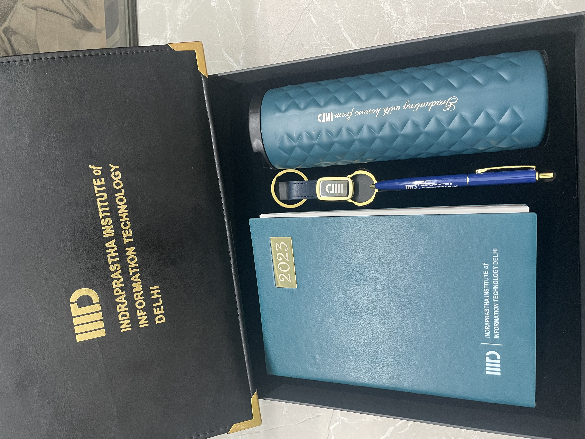
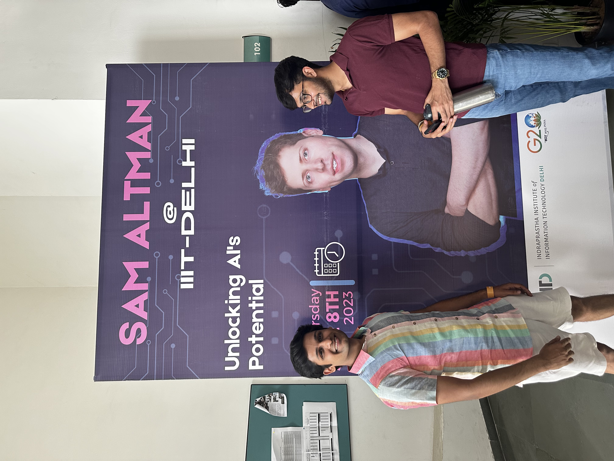

# Undergraduate — IIIT Delhi & Leadership

I studied Computer Science at IIIT Delhi, but for me, undergraduate life was all about what happened beyond the classroom. This was the chapter where I discovered leadership — truly discovered it.

It started with learning to be on stage, finding my voice in front of a crowd. Then came managing a team of 5, followed by an exceptionally capable team of 30, and eventually, an organisation of 400.

*Sponsorship Head for Odyssey '20 — IIIT Delhi's flagship cultural festival.*

*Wearing the Sponsorship Head jacket at the fest grounds.*

*Hosting on stage — where I learned to command a room and connect with an audience.*

*Video from one of the stage moments during college events.*

*The stage became a second home.*

Every year, one student from the entire college receives the Dean's Award for Leadership — and I was honoured to be that recipient.

*Receiving the Dean's Award for Leadership from the Dean of Student Affairs.*

*With the Dean's Award plaque on campus.*

*A proud moment with family after the award ceremony.*

Despite a college life packed with extracurriculars, I graduated with a B.Tech Honours degree — an achievement that approximately 40 students out of a batch of 460 earned.

*Receiving the B.Tech Honours award from the Director of the university.*

*The "Graduating with Honours from IIITD" commemorative set.*

*The full Honours keepsake from IIIT Delhi, Class of 2023.*

*Bonus: Sam Altman's visit to IIIT Delhi — a memorable moment during my time on campus.*
